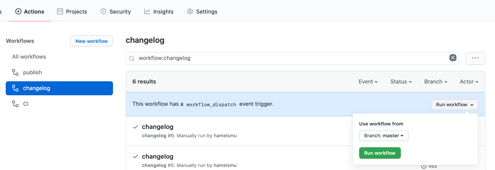
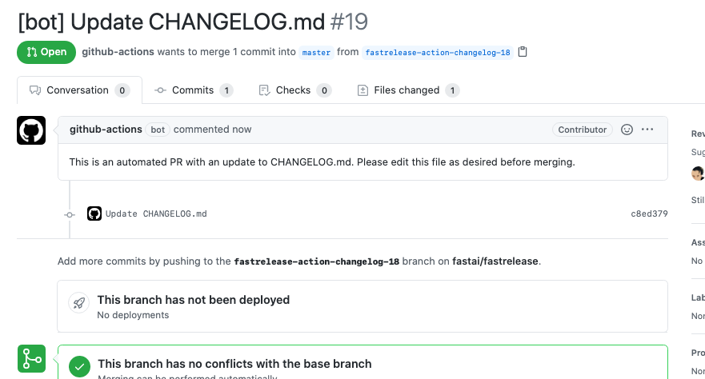
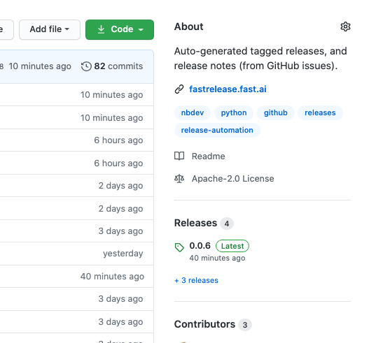

# Instructions

**To automate releases with GitHub Actions, you will have to add two workflows shown below to the `.github/workflows` directory of your repository.**  For purposes of this example, we can call these two workflow files `changelog.yaml` and `publish.yaml`, respectively.

The first workflow, `changelog.yaml` is triggered by a `workflow_dispatch` event, which allows you to trigger this workflow manually from the Actions tab of your repository.  This workflow queries PRs and Issue titles associated with your repository and uses this to create a PR with suggested changes to your `CHANGELOG.md` file at the root of your repository.

```yaml
#.github/workflows/changelog.yaml
name: changelog
on: workflow_dispatch
jobs:
  build:
    runs-on: ubuntu-latest
    steps:
    - uses: actions/checkout@v2
    - name: Update CHANGELOG.md
      uses: ./action/changelog
      with:
        TOKEN: ${{ secrets.GITHUB_TOKEN }}
```

The second workflow, `publish.yaml`, will automatically be triggered when a pull request opened by the first workflow is merged into master. This workflow preforms the following steps:

1.  Generates a new tag based on the version number in `settings.ini` file in the root of your repo.
2.  Uploads this tagged release to GitHub.
3.  Bumps the version number in `settings.ini` and commits that to GitHub.

```yaml
#.github/workflows/publish.yaml
name: publish release
on: 
  push:
    branches:
      - master
jobs:
  build:
    if: (github.event.head_commit.author.username == 'github-actions[bot]') && contains(github.event.head_commit.message, 'Update CHANGELOG.md')
    runs-on: ubuntu-latest
    steps:
    - uses: actions/checkout@v2
    - uses: actions/setup-python@v2
      with:
        python-version: '3.7'
        architecture: 'x64'
    - uses: ./action/publish
      with:
        token: ${{ secrets.GITHUB_TOKEN }}
```

# Walkthrough

1. When you are ready to cut a new release, trigger `changelog` workflow to run by clicking the run workflow button (under the Run workflow dropdown menu) in the `changelog` section the Actions tab of your repository.

    

2. A pull request is automatically opened that makes changes to your `CHANGELOG.md` file that will look like this:

    

3.  Update the `CHANGELOG.md` as appropriate, and merge the Pull Request.  Upon merging this PR, the `publish.yaml` workflow will automatically run.

4.  You will be able to see your new release on the homepage of your repo, on the left-hand side:

    
